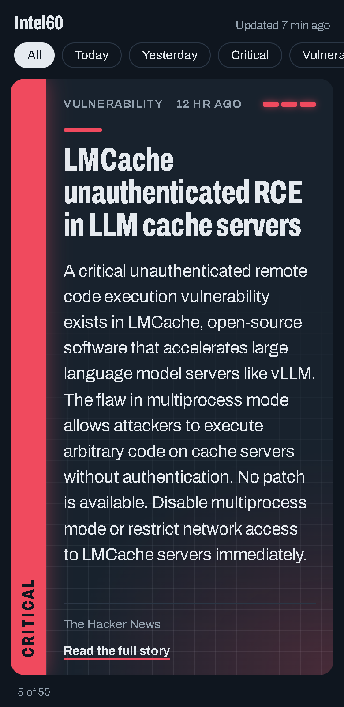
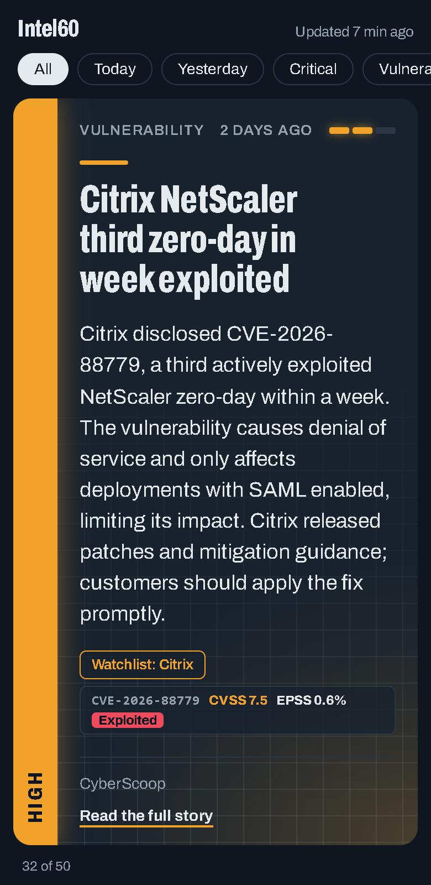
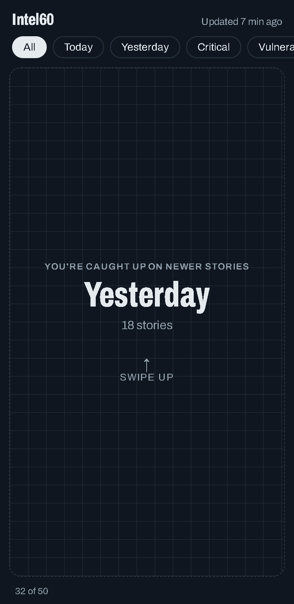
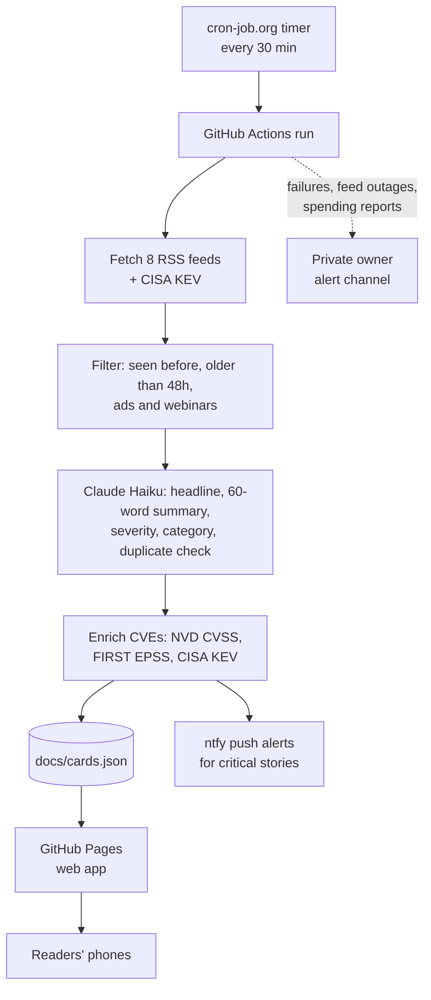

# Intel60

**Cybersecurity news in 60 words.** Intel60 turns the day's security news into swipeable cards for SOC analysts: what happened, who's affected, and what defenders should do, rated by severity and enriched with vulnerability data.

**[Open the app →](https://hammertime19.github.io/intel60/)** (on a phone, use Add to Home Screen to install it)

  
  &nbsp;
  
  &nbsp;
  

## What it does

- **Reads the security press for you.** Every 30 minutes it checks 8 sources (BleepingComputer, The Hacker News, SecurityWeek, Krebs on Security, Dark Reading, The Record, CyberScoop, SANS ISC) plus CISA's Known Exploited Vulnerabilities catalog.
- **Writes a 60-word card per story.** An LLM (Claude Haiku) writes the headline and summary, rates severity (critical / high / info), assigns a category, and merges duplicate coverage when several outlets report the same incident.
- **Adds vulnerability context.** Cards that mention CVEs show the CVSS score (NVD), the probability of exploitation in the next 30 days (FIRST EPSS), and an **Exploited** tag for CVEs on CISA's KEV list.
- **Pushes what matters.** Critical stories, and high-severity stories that match a watchlist of vendors, go to subscribers' phones through [ntfy](https://ntfy.sh), plus a 7am morning brief. Overnight alerts arrive silently.
- **Works like an app.** Installable progressive web app with offline support, one card per screen, Today/Yesterday grouping, severity filters, and text that resizes so every story fits.

## How it works

The AI runs once per story, never per reader: every phone downloads the same `cards.json`, so the cost is the same for 1 reader or 1,000. A run with no new stories makes no AI calls.

## Engineering notes

Problems I hit while running Intel60, and how I handled them:

- **The free AI provider was shut down.** The project originally used GitHub Models' free tier, which GitHub retired in July 2026. Its endpoint started returning a plain `200 OK` instead of JSON, so every run "succeeded" with zero cards. I added logging of the raw response to find the cause, then moved summaries to the Anthropic API (about $3–5/month).
- **GitHub's scheduler was unreliable.** On a new repo, the `cron` trigger ran every 4–7 hours instead of every 30 minutes. An external timer (cron-job.org) now calls the `workflow_dispatch` API with a fine-grained token scoped to this one repo; GitHub's own schedule stays on as a backup.
- **Overlapping runs clashed.** When two runs queued back to back, the second checked out a stale commit and failed to push. Each run now checks out the latest `main`, and if two runs' card updates still clash, the newer run's cards win.
- **A government feed blocked automated requests.** CISA's advisories RSS returned 403 from GitHub's runners, so it was replaced with CyberScoop and SANS ISC; CISA's KEV catalog (JSON) still works and still feeds the app.
- **Silent failures.** Monitoring alerts the owner, on a separate private channel, when a run fails or recovers, when AI calls fail (for example, out of credit), when a feed has been down for about 3 hours, and when spending passes a budget. A weekly report shows spending so far this month.

## Tech stack

Python (requests, feedparser) · GitHub Actions · GitHub Pages · Anthropic API (Claude Haiku 4.5) · NVD API · FIRST EPSS API · CISA KEV · ntfy · vanilla HTML/CSS/JS progressive web app with a service worker for offline use

## Project structure

| Path | What it is |
|---|---|
| `pipeline/brief.py` | The pipeline: fetch, filter, summarize, enrich CVEs, alert, write cards |
| `pipeline/config.py` | Feeds, watchlist, filters, alert and budget settings |
| `pipeline/state.json` | Stories already processed, feed health, monthly usage |
| `docs/index.html` | The web app |
| `docs/sw.js` | Offline support and automatic app updates |
| `docs/cards.json` | Current cards (written by the pipeline) |
| `.github/workflows/update.yml` | Runs the pipeline, commits cards, deploys Pages, reports failures |

## Run your own copy

1. **Fork or copy this repo.** The default branch must be `main`.
2. **Add secrets** (Settings > Secrets and variables > Actions):
   - `ANTHROPIC_API_KEY`: from console.anthropic.com. Add about $5 of credit and set a spend limit.
   - `NTFY_TOPIC`: a hard-to-guess topic name for reader alerts, for example `intel60-7f3k9q2m8x`. Anyone who knows an ntfy.sh topic name can read and post to it, so treat it like a password.
   - `NTFY_ADMIN_TOPIC` (optional): a second, private topic for failure alerts and spending reports.
3. **Add a variable** `AI_PROVIDER` = `anthropic`. Set it to `gemini` and add `GEMINI_API_KEY` to use Google's free tier instead.
4. **Allow the workflow to push:** Settings > Actions > General > Workflow permissions > Read and write.
5. **Turn on Pages:** Settings > Pages > Source: GitHub Actions.
6. **Run it:** Actions > Update Intel60 > Run workflow. The first run summarizes the 15 newest stories and sends no alerts.
7. **Optional, recommended:** set up an external 30-minute timer. Send `POST https://api.github.com/repos/<owner>/<repo>/actions/workflows/update.yml/dispatches` with the body `{"ref":"main","inputs":{"source":"timer"}}`, the headers `Authorization: Bearer <token>`, `Accept: application/vnd.github+json` and `X-GitHub-Api-Version: 2022-11-28`, and a fine-grained token limited to the repo with Actions read and write.

Everything else, including feeds, watchlist, quiet hours, morning brief time, alert caps and budget, is in `pipeline/config.py`. To change how stories are written or rated, edit `SYSTEM_PROMPT` in `pipeline/brief.py`.

## Costs

| Part | Cost |
|---|---|
| Claude Haiku summaries (about $0.001 per story) | about $3–5/month |
| GitHub Actions and Pages (public repo) | Free |
| ntfy.sh, cron-job.org, NVD, EPSS, CISA KEV, RSS feeds | Free |

---

Built by Kushal Mankar with AI-assisted development (Claude Code).
